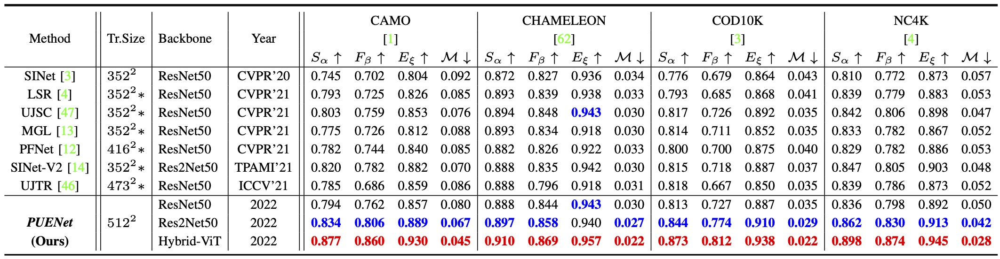
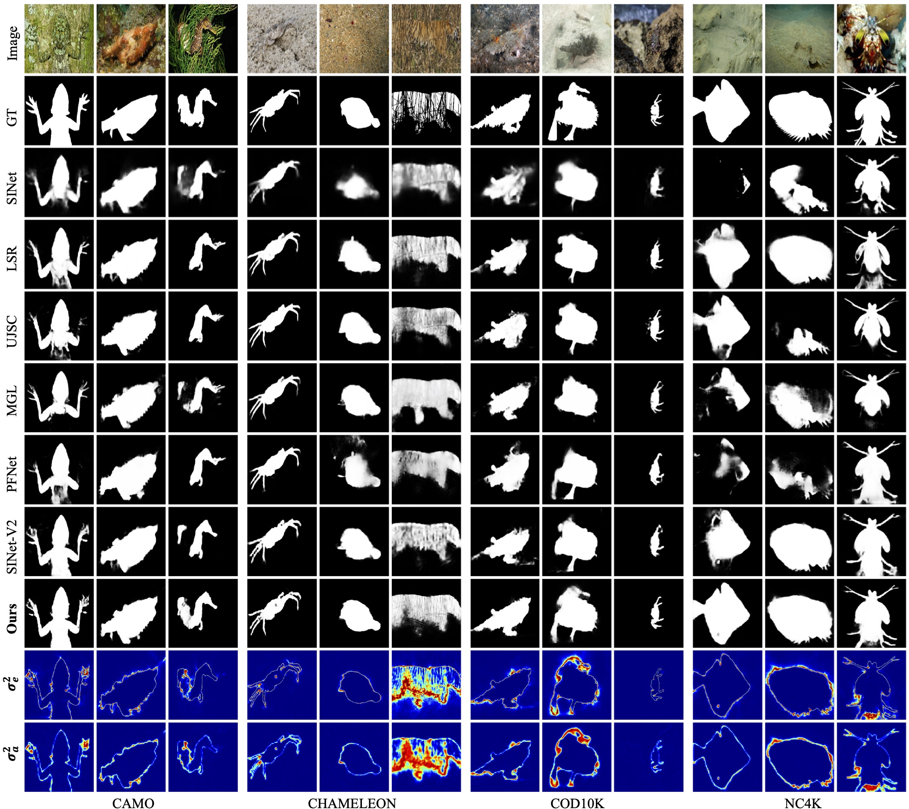

# Predictive Uncertainty Estimation for Camouflaged Object Detection

------

# Performance

      
    <em> 
    Figure 2: Performance comparison with state-of-the-art COD models. * denotes models trained on multi-scale.
    </em>

      
    <em> 
    Figure 3: Visual results of our PUENet and the competing models. “predictive uncertainty approximation” (PUA) module provides “σa2”, which approximates the sampling based predictive uncertainty, i.e., “σe2”.
    </em>

------

# Implementation

The source codes of PUENet are available at [codes](https://github.com/PanoAsh/PUENet/tree/main/codes). 

The training and testing datasets can be downloaded at [COD10K-train](https://drive.google.com/file/d/1D9bf1KeeCJsxxri6d2qAC7z6O1X_fxpt/view), [COD10K-test + CAMO-test + CHAMELEON](https://drive.google.com/file/d/1QEGnP9O7HbN_2tH999O3HRIsErIVYalx/view) and [NC4K](https://drive.google.com/file/d/1kzpX_U3gbgO9MuwZIWTuRVpiB7V6yrAQ/view), respectively.

The results of our PUENet are available at [PUENet-model](https://drive.google.com/file/d/1kGMaF1IlE9qcng8C9au4WG2c71-hAbEN/view?usp=sharing) and [PUENet-predictions](https://drive.google.com/file/d/16-zoDfdkZfU5M50GDeupM2iOlrzozq22/view?usp=sharing).

