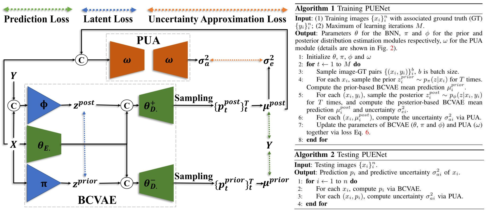
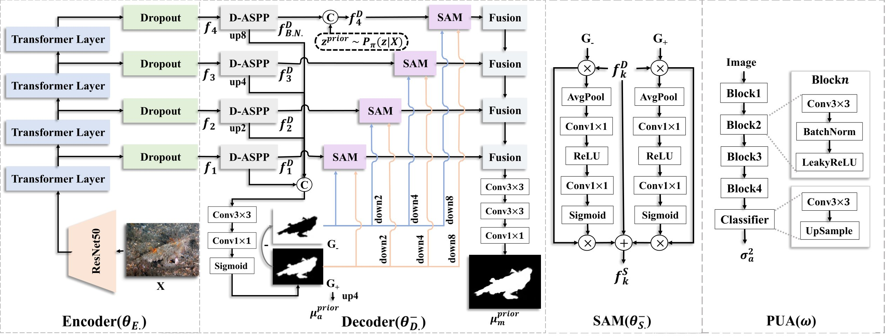
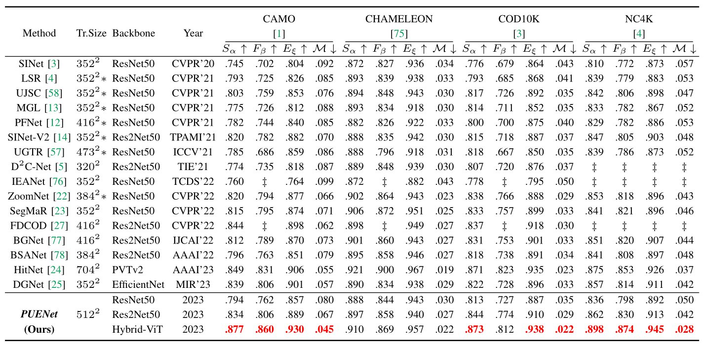
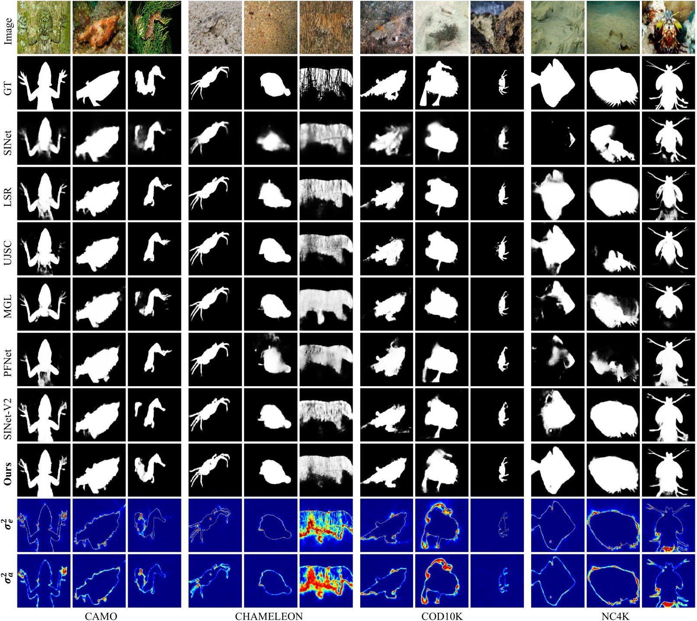

# [Predictive Uncertainty Estimation for Camouflaged Object Detection (TIP 2023)](https://drive.google.com/file/d/1t6x6Cn0V7xy3x_UwS6wyUx-WtLJDwDMO/view?usp=sharing)

Uncertainty is inherent in machine learning methods, especially those for camouflaged object detection aiming to finely segment the objects concealed in background. The strong “center bias” of the training dataset leads to models of poor generalization ability as the models learn to find camouflaged objects around image center, which we define as “model bias”. Further, due to the similar appearance of camouflaged object and its surroundings, it is difficult to label the accurate scope of the camouflaged object, especially along object boundaries, which we term as “data bias”. To effectively model the two types of biases, we resort to uncertainty estimation and introduce predictive uncertainty estimation technique, which is the sum of model uncertainty and data uncertainty, to estimate the two types of biases simultaneously. Specifically, we present a predictive uncertainty estimation network (PUENet) that consists of a Bayesian conditional variational auto-encoder (BCVAE) to achieve predictive uncertainty estimation, and a predictive uncertainty approximation (PUA) module to avoid the expensive sampling process at test-time. Experimental results show that our PUENet achieves both highly accurate prediction, and reliable uncertainty estimation representing the biases within both model parameters and the datasets.

------

# Methodology

      
    <em> 
    Figure 1: The training/testing pipeline of our PUENet, which consists of a “Bayesian conditional variational auto-encoder” (BCVAE), and a “predictive uncertainty approximation” (PUA) module. Please refer to the paper for details.
    </em>

      
    <em> 
    Figure 2: Architectures of “predictive uncertainty approximation” (PUA) module (ω), and “Bayesian conditional variational auto-encoder” BCVAE’s encoder/prior-based decoder. Please refer to the paper for details.
    </em>

------

# Experiment

      
    <em> 
    Figure 3: Performance comparison with SOTA COD models.
    </em>

      
    <em> 
    Figure 4: Visual results of SOTAs and our PUENet.
    </em>

------

# Implementation

The source codes of PUENet are available at [codes](https://github.com/PanoAsh/PUENet/tree/main/codes). 

The training and testing datasets can be downloaded at [COD10K-train](https://drive.google.com/file/d/1D9bf1KeeCJsxxri6d2qAC7z6O1X_fxpt/view), [COD10K-test + CAMO-test + CHAMELEON](https://drive.google.com/file/d/1QEGnP9O7HbN_2tH999O3HRIsErIVYalx/view) and [NC4K](https://drive.google.com/file/d/1kzpX_U3gbgO9MuwZIWTuRVpiB7V6yrAQ/view), respectively.

The results of our PUENet are available at [PUENet-model](https://drive.google.com/file/d/1kGMaF1IlE9qcng8C9au4WG2c71-hAbEN/view?usp=sharing) and [PUENet-predictions](https://drive.google.com/file/d/16-zoDfdkZfU5M50GDeupM2iOlrzozq22/view?usp=sharing).

